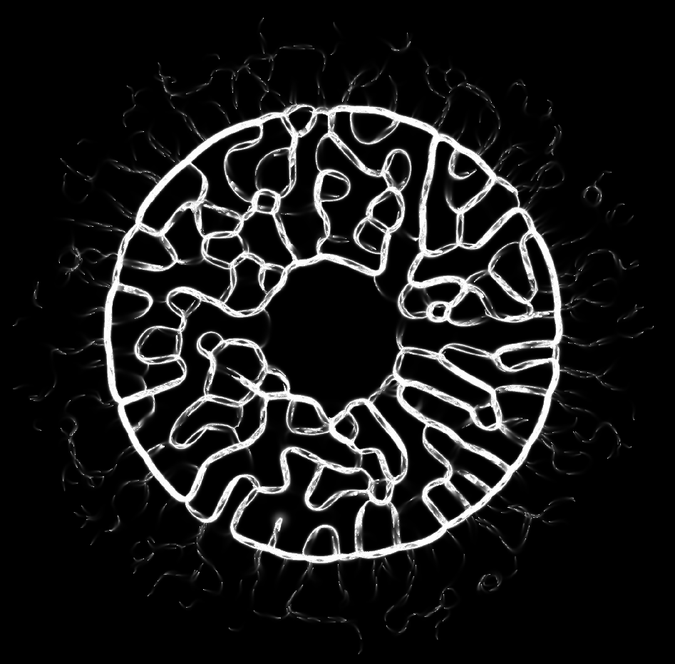

## Physarum and other 2D simulations in Rust

The week-end's experiment: the goal was to simulate 2D things using webgpu via
the webgpu Rust library (https://github.com/gfx-rs/wgpu-rs).

Two models:

- physarum slime mold: see https://sagejenson.com/physarum
- conway's game of life
